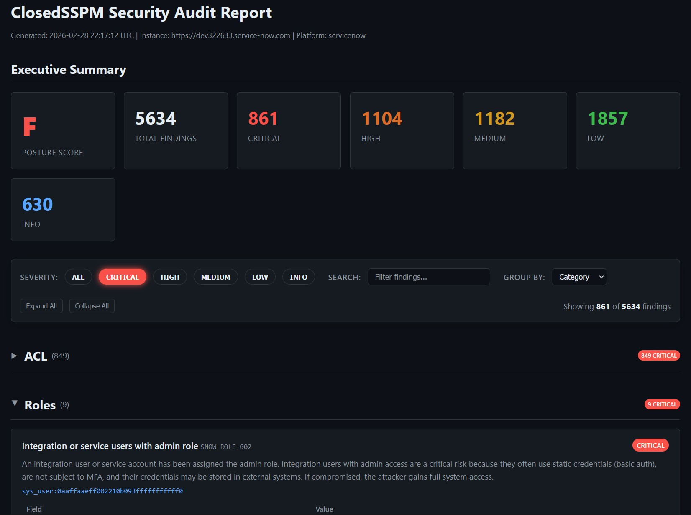

# ClosedSSPM

[](https://github.com/PiotrMackowski/ClosedSSPM/actions/workflows/ci.yml)
[](https://github.com/PiotrMackowski/ClosedSSPM/actions/workflows/codeql.yml)
[](https://goreportcard.com/report/github.com/PiotrMackowski/ClosedSSPM)
[](LICENSE)
[](go.mod)
[](https://github.com/PiotrMackowski/ClosedSSPM/releases)
[](https://www.bestpractices.dev/projects/12061)
[](https://scorecard.dev/viewer/?uri=github.com/PiotrMackowski/ClosedSSPM)

Open Source SaaS Security Posture Management (SSPM) tool. Audits SaaS platforms for security misconfigurations, starting with deep ServiceNow coverage.



## Features

- **Multi-platform architecture** — pluggable connector registry; add new SaaS platforms without touching core code
- **41 security checks** covering ACLs, roles, scripts, integrations, instance config, and users
- **Policy-as-code** — audit checks defined in YAML, easily extensible with custom policies
- **Embedded policies** — all checks are baked into the binary; no external files needed at runtime
- **HTML reports** — self-contained, dark-themed HTML reports with posture scoring (A–F)
- **JSON output** — machine-readable output for pipeline integration
- **CSV export** — spreadsheet-friendly output for compliance workflows
- **MCP server** — AI-assisted audit analysis via Model Context Protocol (works with Claude, OpenCode, etc.)
- **Offline analysis** — collect data once, analyze many times with snapshot persistence
- **Parallel collection** — concurrent API requests with configurable rate limiting

## Installation

### Homebrew (macOS / Linux)

```bash
brew tap PiotrMackowski/closedsspm
brew install closedsspm
```

### Binary (GitHub Releases)

Download the latest release for your platform from the [Releases](https://github.com/PiotrMackowski/ClosedSSPM/releases) page.

```bash
# Linux amd64
curl -Lo closedsspm.tar.gz https://github.com/PiotrMackowski/ClosedSSPM/releases/latest/download/closedsspm_Linux_amd64.tar.gz
tar xzf closedsspm.tar.gz
sudo mv closedsspm closedsspm-mcp /usr/local/bin/
```

### Debian / Ubuntu (.deb)

```bash
# Download the .deb from the latest release
sudo dpkg -i closedsspm_*.deb
```

### Red Hat / Fedora (.rpm)

```bash
# Download the .rpm from the latest release
sudo rpm -i closedsspm_*.rpm
```

### Docker

```bash
docker pull ghcr.io/piotrmackowski/closedsspm:latest

# Run an audit
docker run --rm \
  -e SNOW_INSTANCE=https://mycompany.service-now.com \
  -e SNOW_USERNAME=audit_user \
  -e SNOW_PASSWORD=secret \
  -v "$(pwd):/out" \
  ghcr.io/piotrmackowski/closedsspm:latest audit --output /out/report.html
```

### Build from Source

```bash
git clone https://github.com/PiotrMackowski/ClosedSSPM.git
cd ClosedSSPM
make all
```

## Quick Start

### Run an Audit

```bash
# Set credentials (never store these in config files)
export SNOW_INSTANCE=https://mycompany.service-now.com
export SNOW_USERNAME=audit_user
export SNOW_PASSWORD=secret

# Full audit: collect + evaluate + report (ServiceNow is the default platform)
closedsspm audit --output report.html

# Explicitly specify a platform
closedsspm audit --platform servicenow --output report.html

# Or step by step:
closedsspm collect --output snapshot.json
closedsspm evaluate --snapshot snapshot.json --output report.html
```

### List Available Checks

```bash
closedsspm checks list
```

### MCP Server (AI-Assisted Analysis)

```bash
# Start MCP server with a snapshot
closedsspm mcp --snapshot snapshot.json
```

Add to your MCP client configuration (e.g. Claude Desktop):
```json
{
  "mcpServers": {
    "closedsspm": {
      "command": "/path/to/closedsspm",
      "args": ["mcp", "--snapshot", "/path/to/snapshot.json"]
    }
  }
}
```

### Custom Policies Directory

By default the binary uses its 41 embedded policies. To override with external policies:

```bash
closedsspm audit --policies /path/to/my/policies --output report.html
```

## CLI Reference

### `closedsspm audit`

Run a full security audit: connect to a SaaS platform, collect data, evaluate policies, and generate a report.

```
Flags:
  --platform string       SaaS platform to audit (default "servicenow")
  --instance string       Platform instance URL (or set via env var)
  --output string         Output file path (default "report.html")
  --format string         Report format: html, json, or csv (default "html")
  --policies string       Path to custom policies directory (default: embedded)
  --save-snapshot string  Also save the raw snapshot to this file
  --concurrency int       Max parallel API requests (default 5)
  --rate-limit float      Max API requests per second (default 10)
```

### `closedsspm collect`

Collect data from a SaaS platform and save a snapshot for offline analysis.

```
Flags:
  --platform string    SaaS platform to collect from (default "servicenow")
  --instance string    Platform instance URL (or set via env var)
  --output string      Output snapshot file path (default "snapshot.json")
  --concurrency int    Max parallel API requests (default 5)
  --rate-limit float   Max API requests per second (default 10)
```

### `closedsspm evaluate`

Evaluate policies against a previously saved snapshot.

```
Flags:
  --snapshot string   Path to snapshot file (default "snapshot.json")
  --output string     Output file path (default "report.html")
  --format string     Report format: html, json, or csv (default "html")
  --policies string   Path to custom policies directory (default: embedded)
```

### `closedsspm mcp`

Start a Model Context Protocol server over stdio for AI-assisted audit analysis.

```
Flags:
  --snapshot string   Path to snapshot file (default "snapshot.json")
  --policies string   Path to custom policies directory (default: embedded)
```

### `closedsspm checks list`

List all available security checks.

```
Flags:
  --policies string   Path to custom policies directory (default: embedded)
```

### Environment Variables

All credentials are read from environment variables. **Never store credentials in config files.**

Each platform uses its own set of environment variables. The `--platform` flag (default: `servicenow`) determines which variables are read.

#### ServiceNow (`--platform servicenow`)

| Variable | Description | Required |
|----------|-------------|----------|
| `SNOW_INSTANCE` | ServiceNow instance URL (e.g. `https://mycompany.service-now.com`) | Yes |
| `SNOW_USERNAME` | Username for basic authentication | Yes (unless using OAuth) |
| `SNOW_PASSWORD` | Password for basic authentication | Yes (unless using OAuth) |
| `SNOW_CLIENT_ID` | OAuth 2.0 client ID | Yes (if using OAuth) |
| `SNOW_CLIENT_SECRET` | OAuth 2.0 client secret | Yes (if using OAuth) |

## Architecture

```
closedsspm/
├── cmd/
│   ├── closedsspm/
│   │   ├── main.go          # CLI commands (platform-agnostic)
│   │   ├── main_test.go     # CLI helper tests
│   │   └── platforms.go     # Blank imports to register platform connectors
│   └── mcp/                 # Standalone MCP server
├── internal/
│   ├── collector/            # Collector interface & snapshot model
│   ├── connector/
│   │   ├── registry.go       # Platform connector registry
│   │   └── servicenow/       # ServiceNow API client & collector
│   ├── finding/              # Finding model & severity
│   ├── mcpserver/            # MCP server implementation
│   ├── policy/               # Policy engine (YAML loading & evaluation)
│   └── report/
│       ├── csv/             # CSV report generator
│       ├── html/            # HTML report generator
│       └── json/            # JSON report generator
└── policies/
    └── servicenow/           # ServiceNow policy definitions (YAML, embedded at build)
```

## Subprojects

| Repository | Purpose | Status |
|------------|---------|--------|
| [homebrew-closedsspm](https://github.com/PiotrMackowski/homebrew-closedsspm) | Homebrew tap — hosts the formula for `brew install closedsspm` | Active — automatically updated by goreleaser on each release |

## Security Checks

41 built-in checks across 6 categories:

| Category | Count | Examples |
|----------|-------|---------|
| **ACL** | 8 | Unprotected ACLs, wildcard roles, public access |
| **Roles** | 5 | Admin role assignments, elevated privileges, role includes |
| **Scripts** | 6 | eval() usage, client-callable script includes, global UI scripts |
| **Integrations** | 7 | Unauthenticated endpoints, basic auth, unvalidated MID servers |
| **Instance Config** | 11 | HTTPS enforcement, session timeout, password policy, SAML signing, SSO bypass |
| **Users** | 4 | Never-logged-in accounts, locked-out active users |

<details>
<summary>Full check list</summary>

| ID | Severity | Category | Description |
|----|----------|----------|-------------|
| SNOW-ACL-001 | CRITICAL | ACL | ACL with no condition, no script, and no role requirement |
| SNOW-ACL-002 | HIGH | ACL | ACL with wildcard role assignment |
| SNOW-ACL-003 | MEDIUM | ACL | Inactive ACL that was previously active |
| SNOW-ACL-004 | INFO | ACL | ACL with admin overrides enabled |
| SNOW-ACL-005 | HIGH | ACL | ACL on sensitive table with weak protection |
| SNOW-ACL-006 | MEDIUM | ACL | Script-based ACL using gs.hasRole admin check only |
| SNOW-ACL-007 | LOW | ACL | ACL rule with no description |
| SNOW-ACL-008 | HIGH | ACL | ACL allows unauthenticated access via public type |
| SNOW-ROLE-001 | HIGH | Roles | Users with admin role |
| SNOW-ROLE-002 | CRITICAL | Roles | Integration/service users with admin role |
| SNOW-ROLE-003 | HIGH | Roles | Roles with elevated privilege flag enabled |
| SNOW-ROLE-004 | MEDIUM | Roles | Roles with no assignable_by restriction |
| SNOW-ROLE-005 | CRITICAL | Roles | Custom role that includes the admin role |
| SNOW-SCRIPT-001 | CRITICAL | Scripts | Business rule script uses eval() or GlideEvaluator |
| SNOW-SCRIPT-002 | HIGH | Scripts | Script include marked as client-callable |
| SNOW-SCRIPT-003 | HIGH | Scripts | Global UI script active and running for all users |
| SNOW-SCRIPT-004 | LOW | Scripts | Active business rule with no description |
| SNOW-SCRIPT-005 | MEDIUM | Scripts | Active before business rule modifying data on sensitive tables |
| SNOW-SCRIPT-006 | LOW | Scripts | Active script include with no description |
| SNOW-INT-001 | CRITICAL | Integrations | Web service endpoint with authentication disabled |
| SNOW-INT-002 | LOW | Integrations | Inactive web service endpoint still defined |
| SNOW-INT-003 | HIGH | Integrations | REST message using basic authentication |
| SNOW-INT-004 | INFO | Integrations | Active OAuth application registered |
| SNOW-INT-005 | HIGH | Integrations | MID Server not in validated status |
| SNOW-INT-006 | HIGH | Integrations | Scripted REST operation without ACL authorization |
| SNOW-INT-007 | MEDIUM | Integrations | Scripted REST operation contains eval() or GlideRecord in script |
| SNOW-CFG-001 | CRITICAL | Instance Config | Instance allows HTTP connections (HTTPS not enforced) |
| SNOW-CFG-002 | HIGH | Instance Config | Session timeout set too high or unlimited |
| SNOW-CFG-003 | HIGH | Instance Config | Password policy does not enforce complexity |
| SNOW-CFG-004 | MEDIUM | Instance Config | Debug mode or logging verbosity enabled in production |
| SNOW-CFG-005 | MEDIUM | Instance Config | High security plugin not activated |
| SNOW-CFG-006 | MEDIUM | Instance Config | IP address access control not configured |
| SNOW-CFG-007 | HIGH | Instance Config | SSL certificate approaching expiration or already expired |
| SNOW-CFG-008 | CRITICAL | Instance Config | LDAP server connection without SSL/TLS encryption |
| SNOW-CFG-009 | CRITICAL | Instance Config | SAML identity provider with unsigned assertions |
| SNOW-CFG-010 | HIGH | Instance Config | SAML identity provider using weak signing algorithm |
| SNOW-CFG-011 | CRITICAL | Instance Config | SSO bypass via direct login.do access not restricted |
| SNOW-USER-001 | MEDIUM | Users | Active user account that has never logged in |
| SNOW-USER-002 | HIGH | Users | Locked out user account still active |
| SNOW-USER-003 | MEDIUM | Users | User account sourced from external directory but active |
| SNOW-USER-004 | INFO | Users | Internal integration user account is active |

</details>

## MCP Server Interface

The MCP server exposes 6 tools and 2 resources over **stdio transport** for AI-assisted security audit analysis.

### Tools

| Tool | Parameters | Description |
|------|-----------|-------------|
| `list_findings` | `severity?` `category?` | List findings, optionally filtered by severity (CRITICAL/HIGH/MEDIUM/LOW/INFO) or category |
| `get_finding` | `finding_id` (required) | Get detailed information about a specific finding |
| `get_summary` | _(none)_ | Overall audit summary with posture score and finding counts by severity/category |
| `query_snapshot` | `table` (required) `field?` `value?` `limit?` | Query raw ServiceNow records from the snapshot (default limit: 50, max: 500) |
| `suggest_remediation` | `finding_id` (required) | Get remediation steps and context for a specific finding |
| `list_tables` | _(none)_ | List all collected tables with record counts |

### Resources

| URI | Description |
|-----|-------------|
| `closedsspm://summary` | Audit posture summary (JSON) |
| `closedsspm://snapshot/meta` | Snapshot metadata: platform, instance URL, collection time, table count (JSON) |

## Security Best Practices

- Credentials are **only** read from environment variables, never from config files
- Snapshots may contain sensitive data — treat them as confidential
- The MCP server uses **stdio transport only** (no network exposure)
- The tool is **read-only** — it never writes to your SaaS platform
- ServiceNow audit user should have **read-only** roles (minimum required permissions)

### Minimum ServiceNow Permissions

Create a dedicated audit user with these roles:
- `itil` (read access to most tables)
- `security_admin` (read access to ACLs and security config)
- Disable `web_service_access_only` is NOT recommended for this user; use OAuth where possible

## Writing Custom Policies

Policies are YAML files organized by platform in the `policies/` directory (e.g. `policies/servicenow/`):

```yaml
id: CUSTOM-001
title: "Custom check description"
description: "Detailed explanation of what this checks"
severity: HIGH    # CRITICAL, HIGH, MEDIUM, LOW, INFO
category: Custom
platform: servicenow
query:
  table: sys_security_acl
  field_conditions:
    - field: "active"
      operator: "equals"     # empty, not_empty, equals, not_equals, contains
      value: "true"
remediation: "How to fix the issue"
references:
  - "https://docs.example.com"
```

## Testing

Run the full test suite:

```bash
make test
# or directly:
go test ./...
```

Run static analysis:

```bash
make vet
go vet ./...
```

All pull requests must pass CI (tests + `go vet`) before merging.

## Contributing

Contributions are welcome. Please follow these guidelines:

1. **Open an issue first** — describe the bug or feature before starting work
2. **Fork and branch** — create a feature branch from `main`
3. **Follow existing patterns** — match the project's code style and structure
4. **Add tests** — new features and bug fixes should include tests
5. **All CI checks must pass** — tests, `go vet`, CodeQL, and Trivy scans
6. **One PR per change** — keep pull requests focused and reviewable

See [SECURITY.md](SECURITY.md) for reporting vulnerabilities (do **not** use public issues for security bugs).

## Reporting Issues

Found a bug or have a feature request? Open an issue on the [GitHub Issues](https://github.com/PiotrMackowski/ClosedSSPM/issues) page.

When reporting a bug, please include:
- ClosedSSPM version (`closedsspm --version`)
- Operating system and architecture
- Steps to reproduce the issue
- Expected vs actual behavior
- Any relevant error output (sanitize credentials before sharing)

## Reporting Vulnerabilities

**Do not report security vulnerabilities through public issues.**

Please use [GitHub Security Advisories](https://github.com/PiotrMackowski/ClosedSSPM/security/advisories/new) to report vulnerabilities privately. See [SECURITY.md](SECURITY.md) for full details including response timelines and scope.


## License

Apache 2.0 — see [LICENSE](LICENSE)
