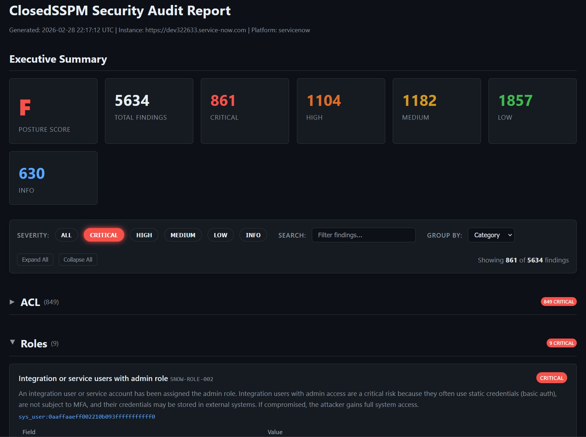

# ClosedSSPM

[](https://github.com/PiotrMackowski/ClosedSSPM/actions/workflows/ci.yml)
[](https://github.com/PiotrMackowski/ClosedSSPM/actions/workflows/codeql.yml)
[](https://goreportcard.com/report/github.com/PiotrMackowski/ClosedSSPM)
[](LICENSE)
[](go.mod)
[](https://github.com/PiotrMackowski/ClosedSSPM/releases)
[](https://www.bestpractices.dev/projects/12061)
[](https://scorecard.dev/viewer/?uri=github.com/PiotrMackowski/ClosedSSPM)

ClosedSSPM is an Open Source SaaS Security Posture Management tool. It audits SaaS platforms for security misconfigurations across ServiceNow, Snowflake, Google Workspace, and Microsoft Entra ID. The scanner identifies risks and provides actionable remediation guidance.

## Key Features

<div class="grid cards" markdown>

-   **Multi-platform Support**
    ---
    Audit ServiceNow, Snowflake, Google Workspace, and Microsoft Entra ID from a single tool.

-   **166 Security Checks**
    ---
    Comprehensive coverage across supported platforms to identify critical misconfigurations.

-   **Policy-as-Code**
    ---
    Manage and customize security checks using a flexible YAML-based policy engine.

-   **Extensive Reporting**
    ---
    Generate results in HTML, JSON, CSV, and SARIF formats for human review or tool integration.

-   **AI-Assisted Analysis**
    ---
    Integrated MCP server allows AI agents to analyze scan results and suggest fixes.

-   **CI/CD Integration**
    ---
    Official GitHub Action and `--fail-on` threshold support for automated security gates.

-   **Offline Analysis**
    ---
    Capture snapshots of platform state for later analysis without requiring live access.

-   **Automated Audits**
    ---
    Schedule regular scans to ensure continuous compliance and security posture.

</div>



[View interactive example report (synthetic data)](gw-report-demo.html){ .md-button }

## Quick Example

!!! tip "Try it out"

    Configure your environment variables and run a scan against your instance.

    ```bash
    export SNOW_INSTANCE=https://mycompany.service-now.com
    export SNOW_USERNAME=audit_user
    export SNOW_PASSWORD=secret
    closedsspm audit --output report.html
    ```

## Supported Platforms

| Platform | Security Checks | Documentation |
| :--- | :--- | :--- |
| ServiceNow | 86 checks | [Platform Details](platforms/servicenow.md) |
| Snowflake | 55 checks | [Platform Details](platforms/snowflake.md) |
| Microsoft Entra ID | 15 checks | [Platform Details](platforms/entra-id.md) |
| Google Workspace | 10 checks | [Platform Details](platforms/google-workspace.md) |

## Get Started

Check the [Installation Guide](getting-started/installation.md) to set up ClosedSSPM and run your first audit.
